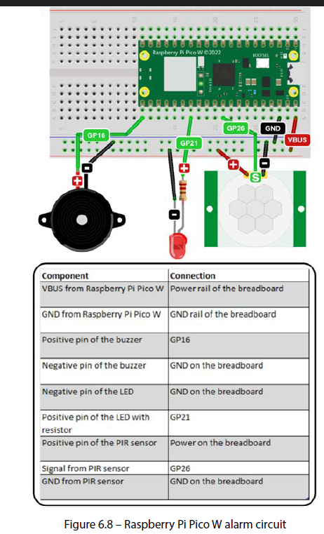
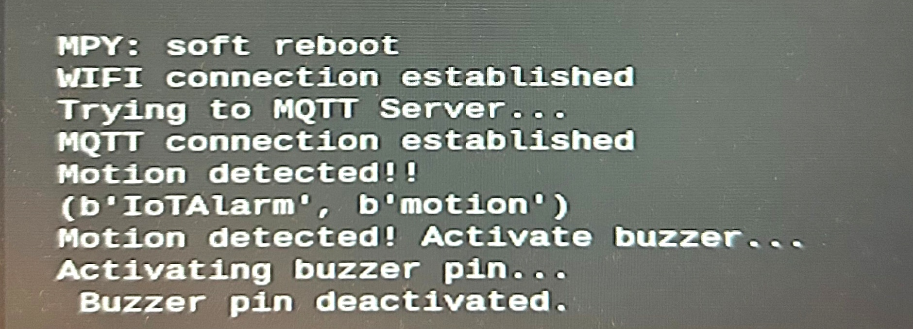

# Raspberry Pi Pico 2 W IoT Alarm with MQTT and HiveMQ

A MicroPython IoT alarm project using a **Raspberry Pi Pico 2 W**, PIR motion sensor, LED, buzzer and **HiveMQ Cloud** as the MQTT broker.

The project detects motion with a PIR sensor and publishes an MQTT message. The Pico subscribes to the same MQTT topic and activates the buzzer when the `motion` message is received.

## Project overview

```text
                Wi-Fi
PIR Sensor ──► Pico 2 W ─────────► HiveMQ Cloud
                  │                    │
                  │ MQTT publish       │ MQTT broker
                  │                    │
                  ◄────────────────────┘
                         MQTT subscribe
                  │
                  ├──► LED status
                  └──► Buzzer alarm
```

## Hardware

- Raspberry Pi Pico 2 W
- PIR motion sensor
- Buzzer
- LED
- Resistor for the LED
- Breadboard
- Jumper wires
- USB cable
- Wi-Fi connection

## Circuit

The following diagram shows the alarm circuit used for the project.



### Pin connections

| Component | Pico / Breadboard connection |
|---|---|
| Buzzer positive | GP16 |
| Buzzer negative | GND |
| LED positive | GP21 through resistor |
| LED negative | GND |
| PIR sensor VCC | Breadboard power / VBUS |
| PIR sensor signal | GP26 |
| PIR sensor GND | GND |

> **Note:** The circuit diagram supplied with the project is labelled for the Raspberry Pi Pico W. The code uses the same GPIO assignments on the Pico 2 W.

## Software

- MicroPython
- Thonny IDE
- MQTT
- HiveMQ Cloud
- `umqtt.simple`

### Files

```text
.
├── main.py
├── buzzer.py
├── README.md
├── .gitignore
└── images/
    ├── alarm-circuit.png
    └── thonny-success-motion-detection.jpg
```

## HiveMQ Cloud configuration

I used the HiveMQ web interface to configure the MQTT environment.

The setup consisted of:

1. Creating/accessing a HiveMQ Cloud account.
2. Creating a Cloud Cluster.
3. Creating MQTT authentication credentials.
4. Using the cluster hostname, MQTT username and MQTT password in the MicroPython application.
5. Connecting to the broker using MQTT over TLS on port `8883`.

### Important security note

The GitHub version of `main.py` in this repository uses placeholders:

```python
SSID = "YOUR_WIFI_SSID"
PASSWORD = "YOUR_WIFI_PASSWORD"

MQTT_SERVER = "YOUR_HIVEMQ_CLUSTER_HOSTNAME"
MQTT_PORT = 8883
MQTT_USER = "YOUR_HIVEMQ_USERNAME"
MQTT_PASSWORD = "YOUR_HIVEMQ_PASSWORD"
```

Replace these locally on the Pico with your own credentials.


## Modifications made to the original project

I made several modifications to the MQTT implementation so that the project would work with HiveMQ Cloud.

### 1. HiveMQ Cloud authentication

The MQTT client is configured with a username and password:

```python
mqtt_client = MQTTClient(
    device_id,
    MQTT_SERVER,
    user=MQTT_USER,
    password=MQTT_PASSWORD,
    port=MQTT_PORT,
    ssl=True,
    ssl_params={"server_hostname": MQTT_SERVER},
)
```

This was important because HiveMQ Cloud requires authenticated and encrypted MQTT communication.

### 2. MQTT over TLS

The connection uses:

```python
MQTT_PORT = 8883
ssl=True
```

Port `8883` is used for MQTT over TLS.

The server hostname is also supplied through:

```python
ssl_params={"server_hostname": MQTT_SERVER}
```

### 3. MQTT topic

The project uses:

```text
IoTAlarm
```

The Pico publishes:

```text
Topic: IoTAlarm
Message: motion
```

When the Pico receives the same message through its MQTT subscription, it activates the buzzer.

### 4. Motion detection

The PIR sensor is connected to **GP26**.

When motion is detected, the interrupt handler publishes:

```python
mqtt_client.publish(MQTT_TOPIC, b"motion")
```

The MQTT callback then checks for:

```python
if topic == MQTT_TOPIC and msg == b"motion":
```

and activates the buzzer.

### 5. Buzzer control

The buzzer is connected to **GP16**.

The separate `buzzer.py` module uses PWM at 4000 Hz and activates the buzzer for five seconds.

```python
BUZZER_FREQ = 4000
```

The buzzer function is called with:

```python
activate_buzzer()
```

## Successful test

The following screenshot shows a successful run in Thonny. The Pico established the Wi-Fi connection, established the MQTT connection, detected motion, received the MQTT message and activated the buzzer.



The relevant output was:

```text
WIFI connection established
Trying to MQTT Server...
MQTT connection established
Motion detected!!
(b'IoTAlarm', b'motion')
Motion detected! Activate buzzer...
Activating buzzer pin...
Buzzer pin deactivated.
```

## How the system works

1. The Pico 2 W connects to Wi-Fi.
2. The Pico connects securely to HiveMQ Cloud using MQTT over TLS.
3. The Pico subscribes to the `IoTAlarm` topic.
4. The PIR sensor detects movement.
5. The Pico publishes `motion` to `IoTAlarm`.
6. HiveMQ Cloud receives and distributes the MQTT message.
7. The Pico receives the subscribed message.
8. The MQTT callback detects `motion`.
9. The buzzer is activated for five seconds.
10. The onboard/status LED indicates the connection state.

## Running the project

### 1. Install MicroPython

Flash MicroPython to the Raspberry Pi Pico 2 W and connect it to Thonny.

### 2. Install the MQTT library

The project requires `umqtt.simple`.

Make sure the library is available on the Pico before running `main.py`.

### 3. Configure credentials

Open `main.py` and replace the placeholder values with your local Wi-Fi and HiveMQ credentials.

### 4. Upload the files

Copy these files to the Pico:

```text
main.py
buzzer.py
```

### 5. Run

Run `main.py` from Thonny.

A successful connection should produce messages similar to:

```text
WIFI connection established
MQTT connection established
```

Move in front of the PIR sensor to trigger the alarm.

## MQTT message flow

```text
PIR detects motion
       │
       ▼
motion_handler()
       │
       ▼
Publish: IoTAlarm / motion
       │
       ▼
HiveMQ Cloud
       │
       ▼
Pico MQTT subscription
       │
       ▼
sub_iotalarm()
       │
       ▼
activate_buzzer()
       │
       ▼
Buzzer ON for 5 seconds
```

## What I learned

This project provided practical experience with:

- MicroPython on a Raspberry Pi Pico 2 W
- GPIO and interrupts
- PWM for controlling a buzzer
- PIR motion sensors
- Wi-Fi networking
- MQTT publish/subscribe communication
- HiveMQ Cloud
- MQTT authentication
- MQTT over TLS
- Thonny
- Basic IoT system architecture
- Separating functionality into Python modules


## Future improvements

Possible next steps include:

- Add a web dashboard to monitor the alarm.
- Add an MQTT command to remotely enable/disable the alarm.
- Store alarm events in a database.
- Add timestamps to motion events.
- Send notifications when motion is detected.
- Add an OLED display.
- Deploy a Python MQTT client on a Raspberry Pi.
- Containerise the backend with Docker.
- Build a cloud-based monitoring dashboard.

---

**Project:** Raspberry Pi Pico 2 W IoT Alarm  
**Language:** MicroPython  
**Protocol:** MQTT  
**Broker:** HiveMQ Cloud  
**IDE:** Thonny
